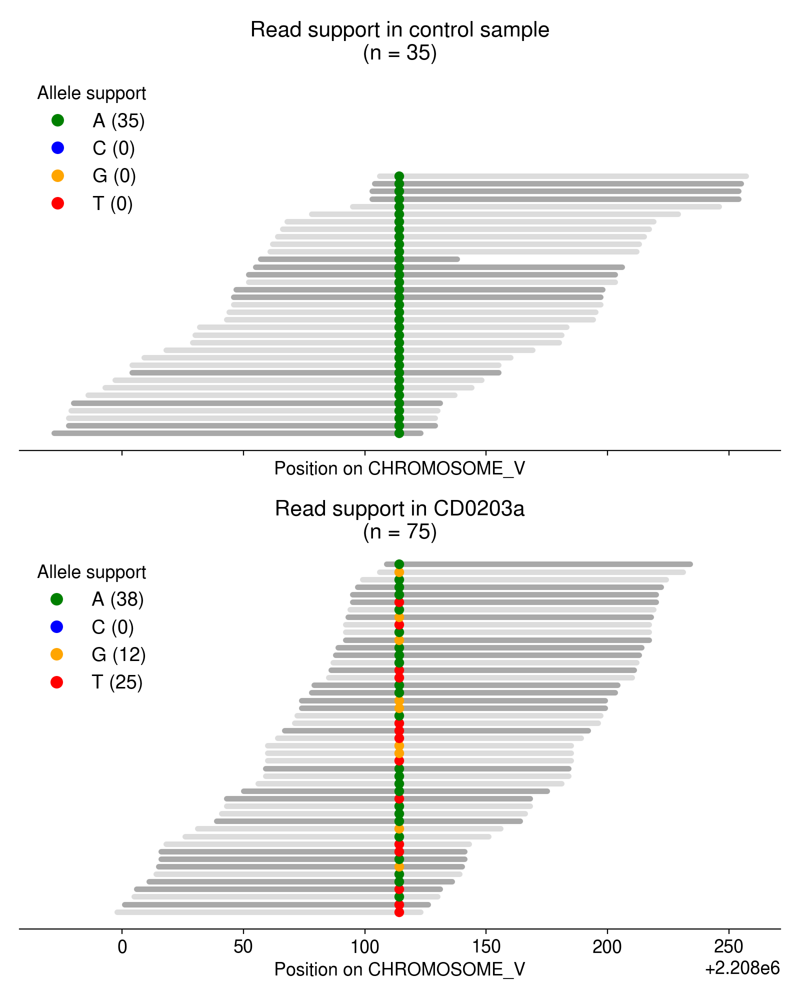
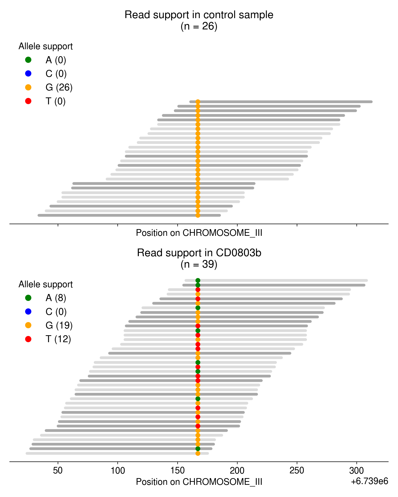
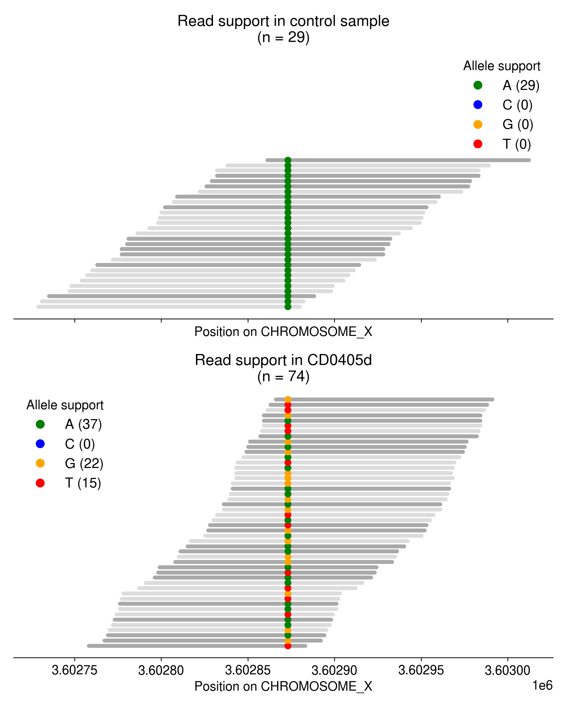
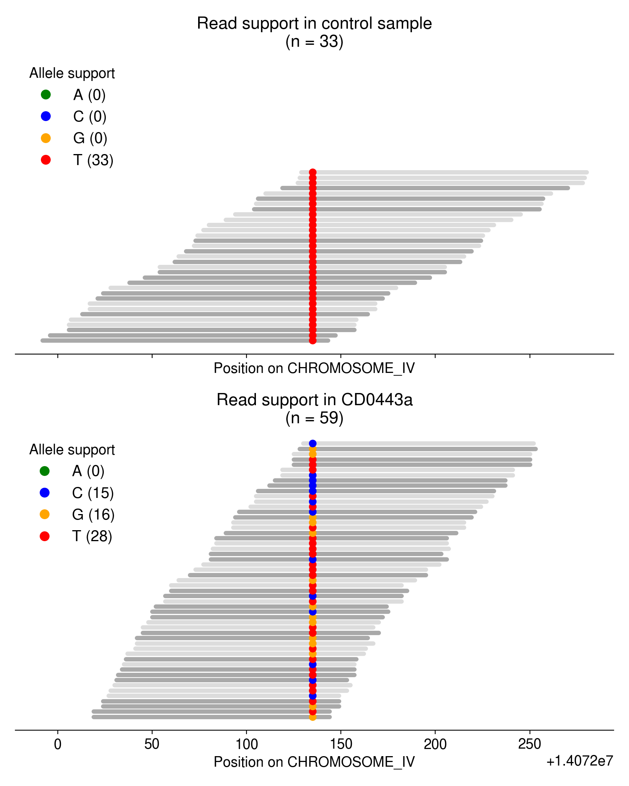

## Abstract

**By reanalyzing sequencing data from a large-scale *C. elegans* mutagenesis experiment, I've found evidence of multiallelic variants in many worms.**
Given the experimental design used in the original paper, I believe the most parsimonious explanation for these multiallelic variants is that parental DNA lesions are inherited by F1 animals, and later serve as templates for multiple rounds of DNA replication during F1 gametogenesis.
Because every sequenced population comprises the offspring of a single F1, mosaicism in the F1's gametes will generate multi-allelic variants in the sequencing reads.

## Background

### *C. elegans* mutagenesis

In 2020, Volkova et al.^[[Volkova et al. (2020), *Nature Communications*](https://www.nature.com/articles/s41467-020-15912-7)] mutagenized *C. elegans* strains with about a dozen unique DNA damaging agents.
Many of these strains harbored homozygous loss-of-function (LOF) alleles in genes related to DNA replication and repair, including translesion synthesis (`polk-1`), nucleotide excision repair (`xpa-1`, `xpc-1`, and `xpf-1`), and so on.
The authors discovered that mutagens leave behind characteristic patterns of single-base substitutions, insertions/deletions, and larger structural variants; we refer to these patterns as "mutational signatures."
They also found that mutation rates and signatures often depend on genetic background (see @fig-volkova).

![
**Mutation signatures depend on genetic background in *C. elegans*.**
Mutation signatures caused by methyl methanesulfonate (MMS) mutagenesis in *C. elegans* strains. Of note, the wild-type MMS mutation signature is significantly different from the MMS mutation signature in `agt-1` alkyltransferase LOF mutants. `agt-1` mutants cannot remove rare $O^6$-methylguanine lesions caused by MMS, resulting in an excess of C$\rightarrow$T mutations absent from WT strains. (Volkova et al. 2020, *Nature Communications*)
](../img/volkova.png){#fig-volkova width=70%}

### Lesion segregation

Also in 2020, Aitken et al.^[[Aitken et al. (2020), *Nature*](https://www.nature.com/articles/s41586-020-2435-1)] mutagenized over 200 mice with a potent DNA damage agent called **DEN**.
By analyzing the specific nucleotide changes (e.g., A$\rightarrow$T vs. T$\rightarrow$A) created by single-nucleotide variants in these mutagenized mice, the authors observed a phenomenon they termed "lesion segregation."
"Lesion segregation" occurs when mutagenic lesions persist for at least one cell division following an initial burst of mutagen exposure.
In that and many follow-up papers^[see [Anderson et al. (2024), *Nature*](https://www.nature.com/articles/s41586-024-07490-1?fromPaywallRec=false)], Aitken and colleagues discovered that persistent DNA lesions are engines of multi-allelic variation (see @fig-anderson).

{#fig-anderson width=70%}

### The *C. elegans* germline as a mutation "bottleneck"

The experimental strategy in Volkova et al. (2020) lets us make a few predictions about the kinds of mutations we'll observe in sequenced nematodes.

::: {.callout-note collapse="true" icon="false"}
# Overview of mutagenesis experiment in Volkova et al. (2020)
1. Mutagenize P0 worms.
    - P0s were mutagenized at different life stages depending on the mutagen of interest. For now, we'll focus on alkylating agents (EMS, MMS, DMS) and bulky adducts (Aflatoxin-B1, Aristocholic acid), which were applied to young adult (YA) worms.
2. Transfer three mutagenized P0s to a single plate, let them lay eggs (which will develop into F1s), and remove adult P0s.
3. Transfer two L4 F1s to two new plates (one per plate) and allow to proliferate.
4. Choose a single expanded F1 population for sequencing.

{width=35% fig-align="center"}
:::

Because a single F1 -- the "child" of a mutagenized P0 -- is used to initiate the clonal population of worms used for sequencing, we only expect to observe mutations derived from lesions that were present in the progenitors of a single P0 sperm cell and a single P0 egg cell.

As it's more succintly described in the Methods section of Volkova et al. (2020):

> *The zygotes which lead to the F1 generation provide a single cell bottleneck where mutations of exposed male and female germ cells are fixed before being clonally amplified during C. elegans development and passed on to the next generation in a Mendelian ratio.*

## Results

### Widespread evidence of multi-allelic mutations in mutagenized worms

I re-analyzed sequencing data from Volkova et al. (2020) and found compelling evidence for multi-allelic mutations in many mutagenized strains.
**All results below are derived from 712 strains treated with DMS, MMS, or EMS.**

As an example, take a look at the single-nucleotide variants in @fig-multiallelic.

::: {#fig-multiallelic layout-ncol=2 layout-nrow=2}

{#fig-multiallelic-a width=90%}

{#fig-multiallelic-b width=90%}

{#fig-multiallelic-c width=90%}

{#fig-multiallelic-d width=90%}

**Multiallelic mutation evidence in mutagenized worms.**
Each aligned sequencing read is represented by a light or dark grey line. Reads are colored according to their orientation with respect to the reference (light gray = forward, dark grey = reverse). At a focal position in the center of the image, the nucleotide present in each read is shown as a colored point. The top subplot shows read evidence in a control sample (non-mutagenized) and the bottom subplot shows read evidence in the mutagenized sample. Only reads with MQ=60 and bases with BQ>=20 are shown. Supplementary, secondary, and improperly paired reads are removed.
:::

Most of these multi-allelic variants are supported by just 1 read, but requiring 2+ reads of support for the "third" allele removes the vast majority of candidate MAVs (@fig-elbow).
Based on an extremely arbitrary guess at the "elbow" in the plot below, I require all MAVs to have at least **3 reads of support.**

![
**Most MAVs are only supported by a single sequencing read.**
Blue line shows the total number of multi-allelic variants (MAVs) I discover using the read thresholds on the x-axis (that is, the number of supporting reads that must contain evidence for a third allele at a given SNV).
The red line shows the enrichment of empirical MAVs over the permuted expectation at each read threshold.
At each read threshold, I divide the empirical MAV count by the average number of MAVs identified in each of 100 permutation trials.
Each trial involves permuting the sample labels associated with each mutation, and asking how many SNVs appear to have evidence for an "extra" allele. 
](../img/elbow.png){#fig-elbow}

### What might explain the presence of multiallelic variants?

Initially, I was surprised to see such robust evidence for multi-allelic mutations in these mutagenized worms.
Because each sequenced population is derived from a single F1 animal, we should only observe mutations that were present in a single sperm and egg cell from a single mutagenized P0.
And because sperm and egg cells are haploid, each gamete can only harbor a single allele — the zygote they form will therefore possess a *maximum* of two unique alleles.

*As far as I can tell, there are a few possible explanations for these multi-allelic variants:*

::: {#nte-o1 .callout-note collapse="false" icon="false"}
# Bioinformatic artifacts
Multi-allelic mutations are an artifact caused by poor read alignment, collapsed segmental duplications, PCR errors, etc.
:::

::: {#nte-o2 .callout-note collapse="false" icon="false"}
# Independent mutations at the same nucleotide
The mutagen created lesions at the same exact nucleotide in a sperm cell and an egg cell in a mutagenized P0. One lesion led to the incorporation of one "incorrect" nucleotide, and the other lesion led to the incorporation of another "incorrect" nucleotide. Or, the mutagen created a lesion in one gamete and an independent *de novo* SNV occured at the exact same nucleotide in the other gamete, or during the somatic development of the F1 worm.
:::

::: {#nte-o3 .callout-note collapse="false" icon="false"}
# Lesion persistence from P0 gamete to F1 zygote
The mutagen created a lesion in either the sperm or egg cell in a P0. The lesion was not repaired prior to meiosis II, and the lesion-containing strand was inherited by an F1 animal. The lesion persisted through multiple rounds of cell division as the F1 developed, and ultimately served as a template for multiple rounds of DNA replication during the development of the F1's germ cell pool. In those replication events, the lesion led to the mis-incorporation of 2+ unique nucleotides.
:::

Bioinformatic artifacts (@nte-o1) are the most probable (and most disappointing) source of multi-allelic mutations.
As I show below, however, I don't think they are the cause.

Independent mutations/lesions at the same nucleotide (@nte-o2) seems extremely unlikely given the infinite sites assumption, and given the fact we observe so many multi-allelic mutations across independent strains.

#### Very low probability of multi-allelic mutations occurring by chance

As detailed in @nte-o1, bioinformatic artifacts may partly explain the abundance of multi-allelic mutations.
How can we rule out the possibility of these artifacts?

First, we can use a simple permutation test to demonstrate that multi-allelic mutations are more frequent than we'd expect by chance.
As described in Aitken et al. (2020), I simply permute the sample labels associated with every mutation identified in this dataset.
Then, I collate the read evidence at each site (using a randomly permuted sample's reads instead of the true sample's reads) and ask if there is high-quality support for multiple alleles.
Since a random sample is highly unlikely to harbor evidence for a mutation observed in a completely independent sample (i.e., its genotype should be HOM_REF), I consider these "multi-allelic" variants to be mutations with support for 2+ alleles.

Overall, **the observed evidence for multi-allelic mutations is much greater than we'd expect by chance** (@fig-support).

::: {#fig-support layout-ncol=2}
![
**Support for multi-allelic mutations is greater than we'd expect by chance.**
For every sample, I calculated the number of *de novo* SNVs at which we observed evidence for 3+ alleles (shown as blue dots).
In each of 100 trials, I randomly permuted the sample labels associated with each SNV, and calculated the number of SNVs at which I observed evidence for 2+ alleles.
Here, I plot the total number of observed multi-allelic mutations across the dataset, using either the "true" (empirical) data or the permuted data.
](../img/multi_perm_overall.png){#fig-support-a}

{#fig-support-b}
:::

#### Multi-allelic mutations don't occur in lower-complexity sequence

Another possible explanation for these multi-allelic mutations is that tools like BWA-MEM struggle to align reads in low-complexity, repetitive sequence, introducing base mismatches in the process.
If MAVs tend to arise in low-complexity sequences, they might be a consequence of that repetitive nucleotide content rather than real biology.
To check if this might be the case, I calculated the entropy of the sequence context surrounding every SNV in the dataset, including both MAVs and biallelic SNVs.
Overall, the sequence context surrounding multi-allelic mutations is no less complex than the context surrounding biallelic mutations (@fig-entropy).

{#fig-entropy width=70%}

<!-- #### Multi-allelic mutations don't exhibit greater strand bias than bi-allelic mutations

Finally, I checked if multi-allelic mutations exhibit greater strand bias than biallelic mutations.
If the "third alleles" at these MAVs arose due to an error during Illumina sequencing, we might expect the "third" alleles to be biased toward reads aligned in either the forward or reverse orientation.
So, for every nucleotide with read support at a given SNV, I asked if the reads supporting that nucleotide were biased toward the forward or reverse strand using a binomial test.
If any nucleotide was significantly biased, the site was marked as having strand bias.
While a non-negligible fraction of multi-allelic mutations exhibit strand bias, it's not a significantly higher fraction than for biallelic SNVs.

|   | Strand bias  | No strand bias |
|--------|--------|-|
| **Biallelic**  | 2448   | 25642 |
| **Multiallelic**   | 7   | 94 |  -->

### Could lesions be inherited from P0 to F1?

Given all of the sanity checks above, I think that the explanation in @nte-o3 might be plausible.
Let's walk through how it might happen.
To do so, let's first imagine how a mutagenized germ cell progenitor (i.e., a mitotic germ cell in the *C. elegans* gonad) might undergo both mitosis and meiosis to produce a haploid gamete (@fig-mitosis).

![
**The fate of a mutagenized germ cell progenitor.**
Imagine that we've mutagenized a mitotic germ cell in a young adult (YA) *C. elegans* animal. Mutagenic lesions (red triangles) are present on both the forward and reverse strands of each diploid chromosome. Let's assume this germ cell undergoes one mitotic division before meiosis. Two of the lesions are efficiently removed by nucleotide excision repair (or another pathway) prior to replication, but error-prone DNA polymerases incorporate incorrect nucleotides (blue and orange circles) opposite the other lesions, creating "lesion-mutation duplexes". Because those lesions are not repaired, they are still present in the daughter cells produced by this round of mitosis (note that only one possible daughter is shown). During meiosis, the DNA is replicated once again. Mis-incorporated bases are copied to create "fully-resolved," double-stranded mutations, but a single lesion persists and may end up in a haploid gamete.
](../img/Artboard%206.png){#fig-mitosis}

Critically, if a haploid gamete harbors a lesion-containing strand, that lesion might end up in a fertilized zygote.
And if it's present in a fertilized zygote, there's a chance it would end up in the $P_4$ cell that gives rise to all germ cells in the F1 animal (see @fig-pz).
Because *C. elegans* development is perfectly characterized, we actually know exactly how long the lesion would have to persist to arrive in that $P_4$ germ cell progenitor.

![
**Lesion segregation during early post-zygotic development.**
Here, we trace the fate of a single chromosome with a lesion-containing strand during early *C. elegans* development. Assuming the lesion is not repaired, there is a 50% chance the lesion-containing strand ends up in the $P_1$ cell after the first post-zygotic cell division. If that lesion persists for three more cell divisions, and segregates into the "right" daughter cell each time, it will eventually end up in the $P_4$ cell that gives rise to all germ cells in the adult worm. And the longer the lesion persists, the more likely it is that another incorrect nucleotide (shown as a green circle) will be mis-incorporated opposite the lesion. If that happens, the pool of gametes produced by this worm will be mosaic for both the green and blue mutations.
](../img/Artboard%206_2.png){#fig-pz width=70%}

<!-- Because chromatids independently segregate during cell division, we can easily calculate the probability that the lesion-containing strand will be present in the $P_4$ germline progenitor cell (conditional on the lesion persisting for those cell divisions).
If the zygote only possesses one lesion-containing strand (i.e., only the sperm *or* egg had a persistent lesion), the probability that the lesion persists until $P_4$ is simply $0.5^4 = 6.25\%$.

What if both diploid chromosomes carry one lesion-containing strand?
Then, the probability that $P_1$ contains at least one of those lesions is $1 - 0.5^2 = 75\%$.
The probability that $P_4$ contains at least one lesion is $0.75^4 = 42.2\%$. -->

### Precedence for inherited lesions causing mutations in *C. elegans*

This would not be the first evidence for persistent DNA lesions across generations in *C. elegans.*
Recently, Wang et al. (2023)^[[Wang et al. (2023) *Nature*](https://www.nature.com/articles/s41586-022-05544-w)] demonstrated that paternal exposure to ionizing radiation led to embryonic lethality in later generations of worms.

> *We show that paternal exposure to ionizing radiation results in genome instability in the F1 generation and transgenerational embryonic lethality. We determined that the paternal DNA damage is mainly repaired in the zygote through maternally provided error-prone polymerase theta-mediated end joining (TMEJ), which results in chromosomal aberrations. (Wang et al. 2023)*

However, my re-analysis lets us compare the incidence of lesion persistence across mutagen exposure and genetic backgrounds.

### Multi-allelic mutations after DMS and MMS, but not EMS, treatment

Intriguingly, some mutagens appear to create more multi-allelic mutations than others.
Ethyl methanesulfonate (EMS), dimethyl sulfate (DMS) and methyl methanesulfonate (MMS) are all alkylating agents, but EMS treatment does not appear to produce more multi-allelic mutations than expected by chance (@fig-multiallelic-by-mutagen).
In the plots below, I aggregate all mutations caused by these mutations regardless of genetic background or dose.
In *C. elegans*, the mutation spectra created by DMS and MMS exposure are very similar (mostly T $\rightarrow$ N mutations), while EMS is dominated by C $\rightarrow$ T mutations.

{#fig-multiallelic-by-mutagen}

<!-- probably sperm cells that are accumulating this damage that's making it into the zygote

possible that mms is more potent, since more multi-allelics. but confounded by the fact that if EMS is more lethal, fewer F2s will survive and less mosaicism will exist, masking detection ability.

use lesion segregation to ensure we're using the "right" ref base that was lesion-ated

can we infer timing of lesion introduction based on allele frequency? 25/75 split suggests that most MAVs are happening after Z2/Z3 division? tough to say given F2 lethality

https://www.pnas.org/doi/full/10.1073/pnas.0705257104
https://pubmed.ncbi.nlm.nih.gov/14585809/
https://pubmed.ncbi.nlm.nih.gov/15784819/
https://pubmed.ncbi.nlm.nih.gov/17052706/ 
https://www.tandfonline.com/doi/full/10.1080/09553002.2020.1793027
https://www.science.org/doi/10.1126/sciadv.aaz7602
https://www.sciencedirect.com/science/article/abs/pii/0027510793900136?via%3Dihub-->